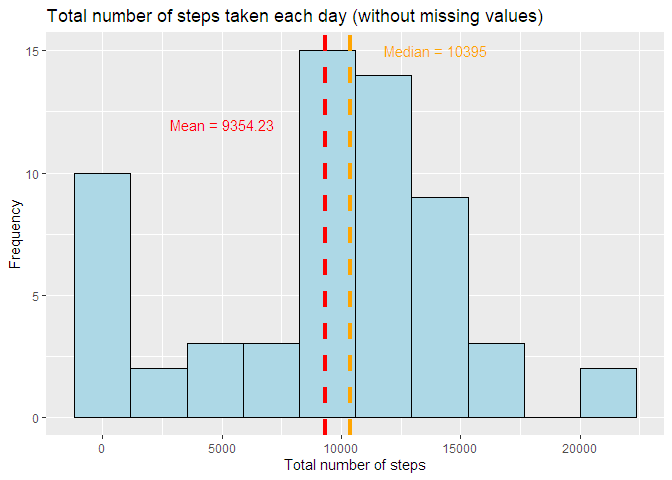
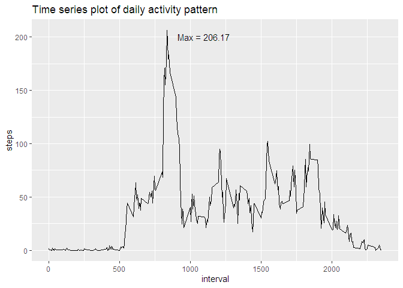
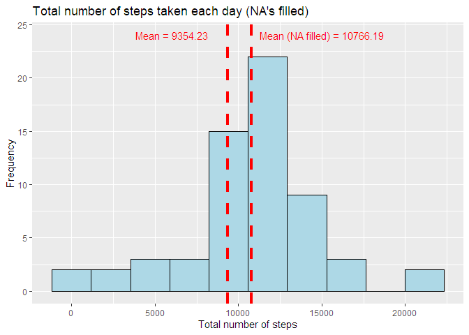
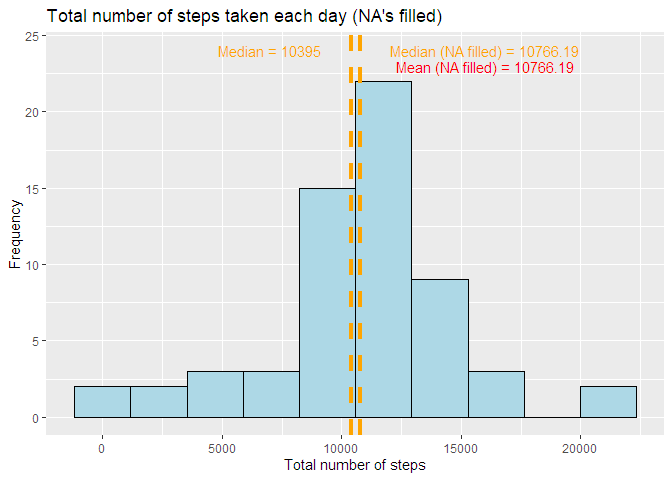
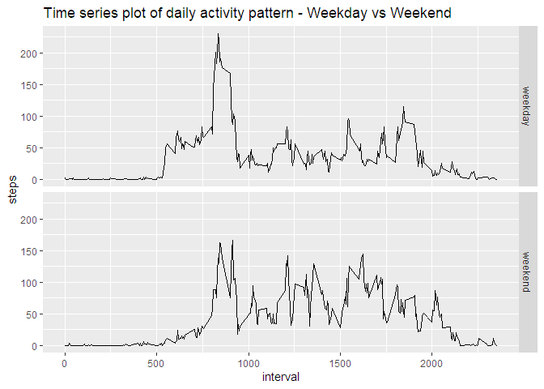

### Loading and preprocessing the data


```r
library(tidyverse)
data <- read_csv("repdata_data_activity.zip")
```

### What is mean total number of steps taken per day?


```r
steps_day <- data %>% group_by(date) %>% 
        summarise(total_steps=sum(steps, na.rm = TRUE))

mean_steps <- paste("Mean =", round(mean(steps_day$total_steps), digits=2))

median_steps <- paste("Median =", median(steps_day$total_steps))

ggplot(steps_day, aes(total_steps)) + 
        geom_histogram(bins = 10, color= "black", fill = "lightblue") + 
        labs(x="Total number of steps",  y="Frequency", 
             title = 
             "Total number of steps taken each day (without missing values)") +
        geom_vline(aes(xintercept = mean(total_steps)),  
                   color="red", linetype="dashed", size=1.5) +
        annotate(geom = "text", x = 5000, y = 12, label = mean_steps, 
                 size=4, color="red") +
        geom_vline(aes(xintercept = median(total_steps)),  
                   color="orange", linetype="dashed", size=1.5) +
        annotate(geom = "text", x = 14000, y = 15, label = median_steps, 
                 size=4, color="orange")
```

<!-- -->

### What is the average daily activity pattern?  
#### Which 5-minute interval, on average across all the days in the dataset, contains the maximum number of steps?


```r
steps_day2 <- data %>% group_by(interval) %>% 
        summarise(steps=mean(steps, na.rm = TRUE))

max_steps <- paste("Max =", round(max(steps_day2$steps), 2))

ggplot(steps_day2, aes(interval, steps)) + geom_line() + 
        labs(title="Time series plot of daily activity pattern") +
        annotate(geom = "text", x = 1100, y = 200, label = max_steps, 
                 size=4, color="black")
```

<!-- -->

### Imputing missing values results in a aproximation of mean to median 


```r
#Number of rows with missing values in variable steps

summary(data$steps)["NA's"]
```

```
## NA's 
## 2304
```

```r
# Filling in all of the missing values with the mean for that 5-minute interval
#(new dataset created)

data2 <- data %>% group_by(interval) %>% 
        mutate_at("steps", zoo::na.aggregate)

#Histogram comparing mean without and with filling missing values

steps_day3 <- data2 %>% group_by(date) %>% 
        summarise(total_steps=sum(steps, na.rm = TRUE))

mean_steps2 <- paste("Mean (NA filled) =", 
        round(mean(steps_day3$total_steps), digits=2))

ggplot(steps_day3, aes(total_steps)) + 
        geom_histogram(bins = 10, color= "black", fill = "lightblue") + 
        labs(x="Total number of steps", 
             y="Frequency", title = 
             "Total number of steps taken each day (NA's filled)") +
        geom_vline(aes(xintercept = mean(steps_day$total_steps)),  
                   color="red", linetype="dashed", size=1.5) +
        geom_vline(aes(xintercept = mean(total_steps)),  
                   color="red", linetype="dashed", size=1.5) +
        annotate(geom = "text", x = 6000, y = 24, label = mean_steps, 
                 size=4, color="red") +
        annotate(geom = "text", x = 15000, y = 24, label = mean_steps2, 
                 size=4, color="red")
```

<!-- -->

```r
#Histogram comparing median without and with filling missing values, now mean and have the same value (normal distribution)

median_steps2 <- paste("Median (NA filled) =", 
        round(median(steps_day3$total_steps), digits=2))

ggplot(steps_day3, aes(total_steps)) + 
        geom_histogram(bins = 10, color= "black", fill = "lightblue") + 
        labs(x="Total number of steps", 
             y="Frequency", title = 
             "Total number of steps taken each day (NA's filled)") +
        geom_vline(aes(xintercept = median(steps_day$total_steps)),  
                   color="orange", linetype="dashed", size=1.5) +
        geom_vline(aes(xintercept = median(total_steps)),  
                   color="orange", linetype="dashed", size=1.5) +
        annotate(geom = "text", x = 7000, y = 24, label = median_steps, 
                 size=4, color="orange") +
        annotate(geom = "text", x = 16000, y = 24, label = median_steps2, 
                 size=4, color="orange") +
        annotate(geom = "text", x = 16000, y = 23, label = mean_steps2, 
                 size=4, color="red")
```

<!-- -->

### Are there differences in activity patterns between weekdays and weekends?


```r
#Add new variable - weekday, then recode to "weekday" or "weekend" 
#Note: weekdays in portuguese

data3 <- data2 %>% mutate(weekday_all= weekdays(date)) %>% 
        mutate(weekday_all, weekday2=(recode (weekday_all,
        "segunda-feira"="weekday", "terça-feira"="weekday",
        "quarta-feira"="weekday", "quinta-feira"="weekday",
        "sexta-feira"="weekday", "sábado"="weekend", "domingo"="weekend")))

#Plot
steps_day4 <- data3 %>% group_by(interval, weekday2) %>% 
        summarise(steps=mean(steps, na.rm = TRUE))

ggplot(steps_day4, aes(interval, steps)) + geom_line() + 
        facet_grid(weekday2~.)+ labs(title=
        "Time series plot of daily activity pattern - Weekday vs Weekend")
```

<!-- -->
